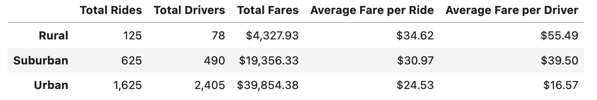

# PyBer Rideshare Analysis

## Overview
PyBer is a Python-based ridesharing app company. As a data analyst, I've been tasked with performing exploratory data analysis (EDA) on PyBer's ridershare data from January to early May of 2019, as well as creating compelling data visualizations for the CEO. The visualizations showcase the relationship between the type of city (Rural, Suburban, or Urban), and the number of drivers and riders, as well as the percentage of total fares, riders and drivers by the type of city. The goal of the analysis is to help PyBer improve access to ride-sharing services and determine affordability for underserved neighborhoods.

After completing the initial exploratory analysis, I've been tasked with creating a summary DataFrame of the ride-sharing data by city type, as well as creating a multiple-line graph that shows the total weekly fares of reach city type. The goal of this new analysis will be to summarize how the data differs by city type and how the differences can be used by decision-makers at PyBer.

## Results

### Ride Data Summary by City Type
The following DataFrame breaks down the PyBer ride sharing data by 'Total Rides', 'Total Drivers', 'Total Fares', 'Average Fare per Ride', and 'Average Fare per Driver' attributes categorized by city types: Rural, Suburban, and Urban. We will examine the DataFrame to determine how these attributes differ by city type. 

__PyBer Summary DataFrame__

- _Total Rides_
    - __Urban__ cities have the most total rides at 1,625 rides.
    - __Suburban__ cities have the second most total rides at 625 rides. 
    - __Rural__ cities have the least total rides at 125 rides.
- _Total Drivers_
    - __Urban__ cities have the most number of drivers at 2,405 total drivers.
    - __Suburban__ cities have the second most number of drivers at 490 total drivers.
    -  __Rural__ cities have the least number of drivers at 125 total drivers.
- _Total Fares_
    - __Urban__ cities have the highest total fares with $39,854.38 in fares.
    - __Suburban__ cities have the second highest total fares at $19,356.33 in fares.
    - __Rural__ cities have the lowest total fares at $4,325.93 in fares.
- _Average Fare per Ride_
  - __Rural__ cities have the highest average fare per ride with $34.62 per ride.
  - __Suburban__ cities have the second highest average fare per ride with $30.97 per ride.
  - __Urban__ cities have lowest average fare per ride with $24.53 per ride.
- _Average Fare per Driver_
    - __Rural__ cities have the highest average fare per driver with $55.49 per driver.
    - __Suburban__ cities have the second highest average fare per driver with $39.50 per driver.
    - __Urban__ cities have lowest average fare per driver with $16.57 per driver.

The PyBer ride-sharing data summary reveals that there are more drivers and total rides occuring in Urban and Suburban cities than Rural cities. Rural cities are likely the least populous of the city types with low population density as well. Accordingly, Rural cities have lower total fares than Suburban and Urban cities. Inversely, Rural areas collect the highest average fare per ride, as well as the highest average fare per driver. This means that it more expensive for Rural ride-sharers to hail a ride through the PyBer app, while Rural driver's earn more income for each ride they give.

Furthermore, Rural and Suburban cities have less drivers than total rides, while Urban cities have far more drivers than total rides. This is likely contributing to high fares per ride and driver for Rural and Suburban cities. Meanwhile, in Urban cities the average fare per ride is lower and the average fare per driver is far lower than in Rural and Suburban cities. These disparities could suggest that the average ride-sharer in Rural and Suburban cities could benefit from greater access, while the average driver in Urban cities could benefit from the opporunity for giving more rides.

For further analysis, it may provide additional insights if we were to research the average population by city type in order to calculate per capita metrics for the ride-sharing data attributes. This may help us understand, which ride-sharing population is more under served by city type by the average individual's level of access.

### Weekly Total Fares by City Type
The following multiple line graph visualizes the week-to-week changes, from January 2019 to April 2019, in weekly total fares for each of the three city types. The blue line represents the Rural city type data, the red line represents the Suburban city type data, and the gold line represents the Urban city type data. This color-coded line representation of the city types' data should help us visually compare the weekly total fare data between each of the three city types with ease.

__Multiple Line Plot: PyBer Weekly Total Fares for Each Type of City (January 2019 - April 2019)__

Trends in weekly total fares by city type for each month from January 2019 to April 2019:

- _January_
  - __Rural__ cities' weekly total fare reached it's minimum level ($67.65) in the second week of the month and peaked at it's maximum level ($306.00) in the third week of the month.
  - __Suburban__ cities' weekly total fare reached it's minimum level ($721.60) in the first week of the month and peaked at it's maximum level ($1,218.20) in the third week of the month.
  - __Urban__ cities' weekly total fare reached it's minimum level ($1,661.68) in the first week of the month and peaked at it's maximum level ($2,129.51) in the fourth week of the month.
- _February_
  - __Rural__ cities' weekly total fare reached it's minimum level ($95.82) in the third week of the month and peaked at it's maximum level ($419.06) in the fourth week of the month.
  - __Suburban__ cities' weekly total fare reached it's minimum level ($974.34) in the second week of the month and peaked at it's maximum level ($1,412.74) in the fourth week of the month.
  - __Urban__ cities' weekly total fare reached it's minimum level ($2,086.94) in the first week of the month and peaked at it's maximum level ($2,466.29) in the fourth week of the month.
- _March_
  - __Rural__ cities' weekly total fare reached it's minimum level ($163.39) in the third week of the month after it peaked at it's maximum level ($303.94) in the second week of the month.
  - __Suburban__ cities' weekly total fare reached it's minimum level ($858.46) in the first week of the month and peaked at it's maximum level ($1,122.20) in the fourth week of the month.
  - __Urban__ cities' weekly total fare reached it's minimum level ($1,942.77) in the final week of the month after it peaked at it's maximum level ($2,470.93) in the second week of the month.
- _April_
  - __Rural__ cities' weekly total fare reached it's minimum level ($191.85) in the second week of the month after it peaked at it's maximum level ($501.24) in the first week of the month.
  - __Suburban__ cities' weekly total fare reached it's minimum level ($784.82) in the second week of the month and peaked at it's maximum level ($1,357.75) in the fourth week of the month.
  - __Urban__ cities' weekly total fare reached it's minimum level ($2,238.29) in the fourth week of the month after it peaked at it's maximum level ($2,390.72) in the second week of the month.

The multiple line plot displays PyBer weekly total fares for each type of city from January 2019 to April 2019. The charted lines representing each city type reveal that Suburban and Urban cities are at their minimum weekly total fares in the first week of January, while Rural cities are at their minimum weekly total fares in the second week of January. The plotted multiple lines also reveal that Suburban and Urban cities also reach their respective weekly total fares peaks at the same time in the fourth week of February, while Rural cities reach their peak weekly total fares in the first week of April.

Additionally, the graph indicates that all city types experience a surge in weekly total fares by the fourth week of February, which lessens throughout March before briefly surging again in early or mid- April.

These discrepancies between Rural cities and Suburban and Urban cities may exist for a multitude of reasons, including cultural or behaviorial differences between the city type demographics (with more similarities between Urban and Suburban poplulation trends), or also variations in season changes in the transitional Winter and Spring months. This could mean lower weekly total fares during colder winter weeks, such as in early January. Conversely, warmer weeks transtioning to spring could explain the result in relatively higher weekly total fares during those weeks.

## Summary
In our analysis results, we found diparities between the Rural, Suburban, and Urban city types, with the most drastic disparity being for Rural cities. We found Rural ride-sharers face high cost of hailing rides, from what appeard to primarily be driven by shortage in driver supply in rural cities. Based on these results and our multiple line time-series analysis of weekly total fares by city type, we recommend addressing these disparities by implementing ride-sharing (demand-side) and driver (supply-side) promotional programs to generate greater level of access to underserved ride-sharing in rural cities. Our three primary recommendations to the CEO for such programs include:

- Urban Driver Rural Commute Fuel Credits (UD-RCFC)
  - This program would aim to incentivize urban drivers to commute to rural cities by offering compensation to credit against driver fuel costs for commuting to and giving rides in rural cities. This should address two disparities at once by offering Urban drivers an opportunity to give more rides and earn income in at a higher average fare per ride, while also increasing access to ride-sharers in rural-cities within driver commuting distance to urban cities.
- Rural City Rider Credits (RCRC)
  - This program would simply provid credits toward rural city rider accounts when fares are high due to driver shortage in the rural cities. Credits will also have the advantage of not disincentivizing drivers by applying raw discounts on fares. The credits will essentially be costs assumed by PyBer to increase volume of rides in rural cities along with greater access to rural ride-sharers.
- PyBer 'Spring Soon' Week (PBSSW)
  - During this special promotional week PyBer would offer both the UD-RCFC and RCRC programs at the same time in anticipation of increased demand during the fourth week of February (as indicated by the weekly total fares multiple line plot). During the first significant demand surge of the year, rural cities may have increased difficulty with access due to demand surge and driver supply constraint. Since, demand will be surging in every city type at the same time. Less Urban drivers may be available to take advantage of the UD-RCFC offer to offset demand fueled fare spikes in rural cities, furthering the rural city ride-share accessibilty disparity during this time. However, combining the UD-RCFC program with double credits of the RCRC program during this one week 'Spring Soon' special promotion, relative accessibility for rural city ride-sharers may be maintained.

This concludes our ride-sharing data analysis report and recommendations for PyBer.

For any further questions, please feel free to reach out to me directly.